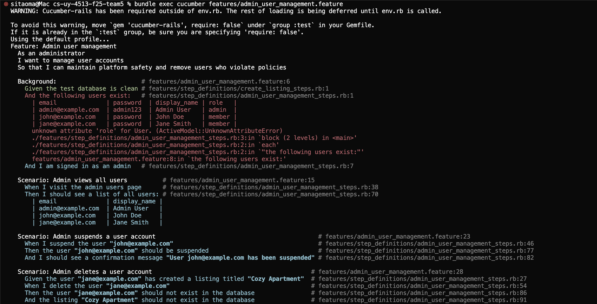
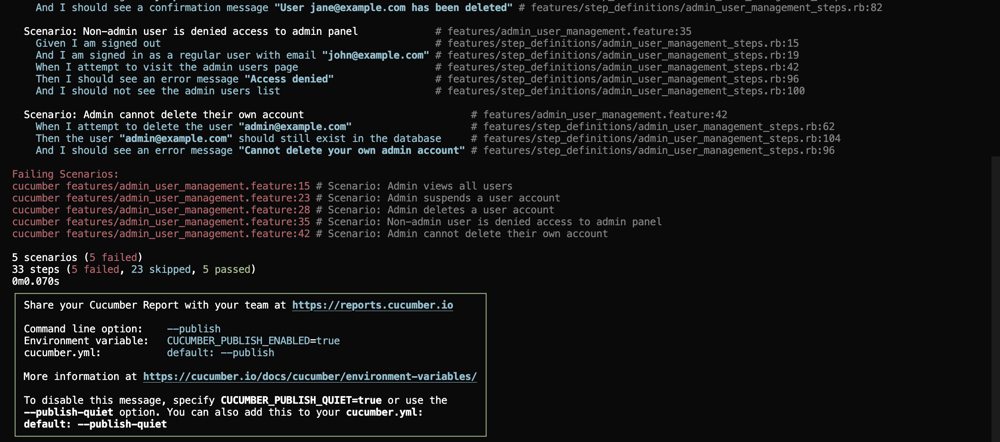

# Admin User Management

## User story

As an administrator, I want to manage user accounts so that I can maintain platform safety and remove users who violate policies.

## Acceptance criteria

1. An admin can visit `/admin/users` to see a list of all registered users, displaying their email and display name.
2. An admin can suspend a user account, preventing that user from logging in or accessing the platform.
3. An admin can permanently delete a user account and all associated data (listings, profile information).
4. A regular (non-admin) user attempting to access `/admin/users` is denied access with an "Access denied" message.
5. An admin attempting to delete their own account from the admin panel sees a validation error "Cannot delete your own admin account".

## MVC Outline

### Models

- `User`
  - attributes: `email:string`, `password:string`, `display_name:string`, `bio:text`, `budget:integer`, `preferred_location:string`, `sleep_schedule:string`, `pets:string`, `housing_status:string`, `contact_visibility:string`, `role:string`, `suspended:boolean`
  - validations: presence of `email` and `password`; `role` must be either "admin" or "member" (default: "member")
  - associations: `has_many :listings, dependent: :destroy`
  - methods: `admin?` returns true if role is "admin"

### Views

- `app/views/admin/users/index.html.erb` to display a table of all users with actions (suspend, delete).
- `app/views/admin/users/show.html.erb` to display detailed information about a specific user.

### Controllers

- `Admin::UsersController` with actions:
  - `index` - display all users
  - `show` - display a single user's details
  - `suspend` - suspend a user account (sets suspended flag or role)
  - `destroy` - delete a user account
  - `before_action :require_admin` - ensure only admins can access these actions

### Routes

```ruby
namespace :admin do
  resources :users, only: [:index, :show, :destroy] do
    member do
      patch :suspend
    end
  end
end
```

### Associations

```ruby
class User < ApplicationRecord
  has_many :listings, dependent: :destroy

  validates :email, presence: true
  validates :password, presence: true
  validates :role, inclusion: { in: %w[admin member] }

  def admin?
    role == 'admin'
  end
end
```

### Screenshots



