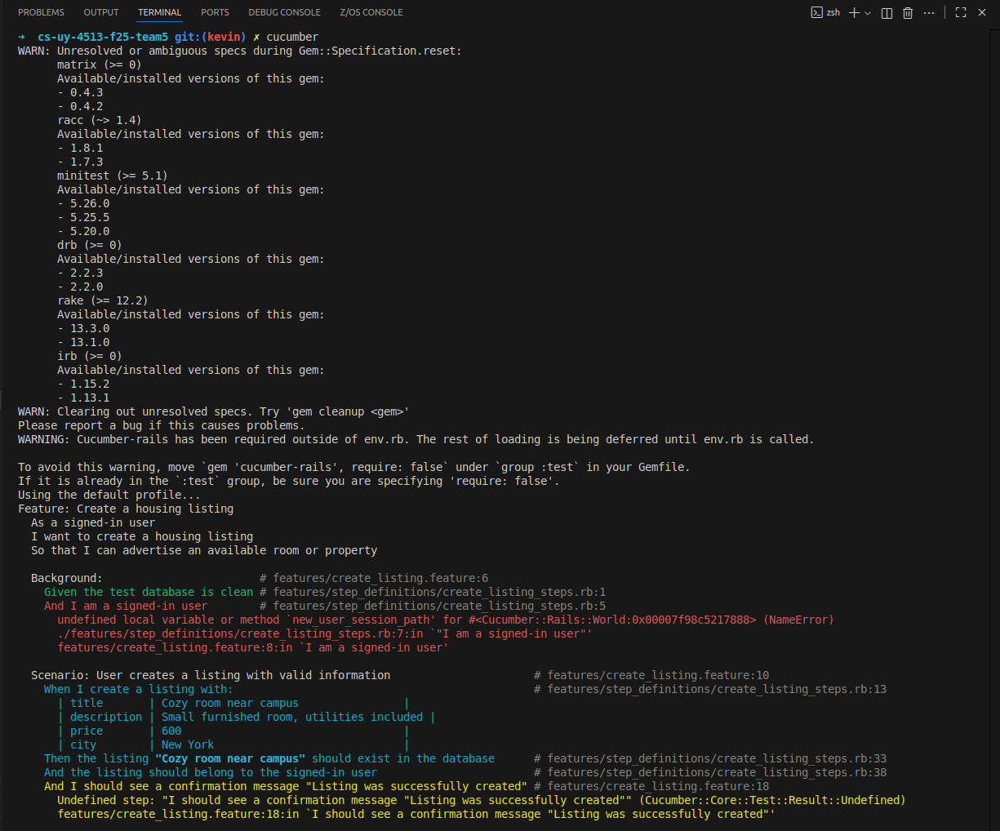
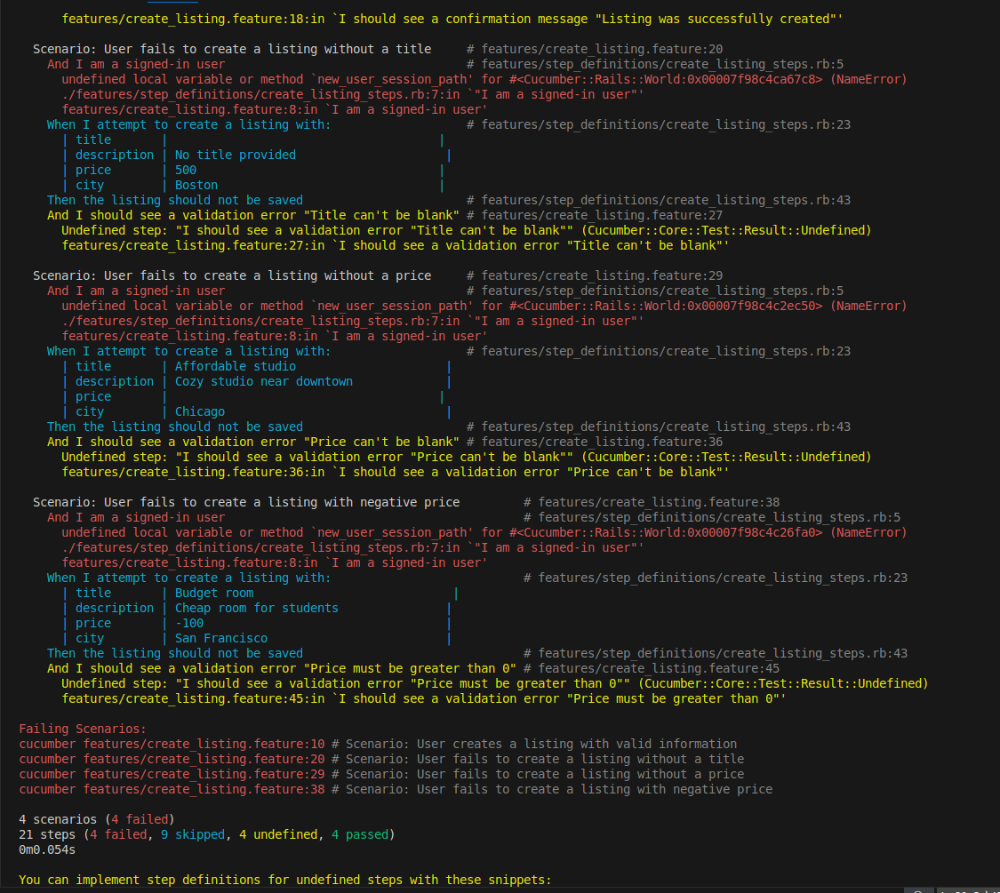
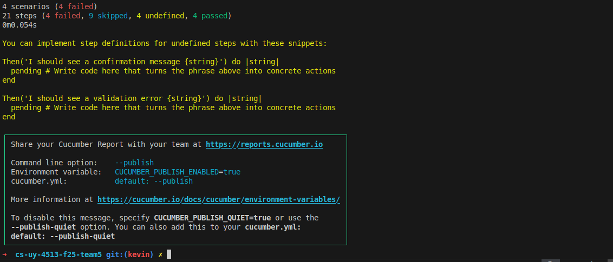

# Create Listing

## User story
As a signed-in user, I want to create housing listings so that I can advertise rooms/apartments for potential roommates.

## Acceptance criteria
1. A signed-in user can create a new listing with a title, description, price, and location. After creation, the listing is persisted and associated with the user.  
2. Attempting to create a listing without a title fails with a validation error.
3. Attempting to create a listing without a price fails with a validation error.
3. Attempting to create a listing with a negative price fails with a validation error.

## MVC Outline

### Models
- `User`
- `Listing`  
  - attributes: `title:string`, `description:text`, `price:decimal`, `city:string`, `user_id:integer`  
  - validations: presence of `title` and `price`  

### Views
- `listings/new.html.erb` (form to create a listing)  

### Controllers
- `ListingsController` with `new` and `create` actions  

### Associations 
```ruby
class Listing < ApplicationRecord
  belongs_to :user
end

class User < ApplicationRecord
  has_many :listings
end
```

### Screenshots


