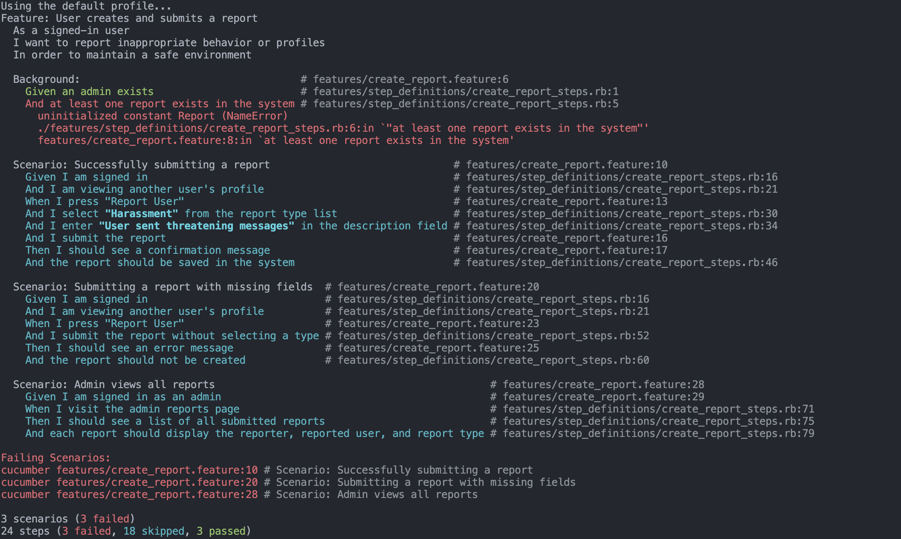

# Create Report

## User Story
As a signed-in user, I want to submit a report when I encounter spam, harassment, fake profiles, or other issues so that the platform can take action and maintain a safe user environment.

## Acceptance Criteria
1. A signed-in user must be able to create a report from a user profile or conversation.
2. A report must include a type (spam, harassment, fake profile, other), a description, and the reported user.
3. The system must store the report persistently.
4. Admins must be able to view all reports.
5. Users should receive confirmation that their report was submitted.
6. Invalid or incomplete submissions should return an error.

## MVC Outline

### Models
- `User`
- `Report`
  - attributes:`report_type:string`, `description:text`, `reporter_id:integer`, `reported_user_id:integer`, `status:string`
  - validations: presence of `report_type`, `description`, `reporter_id`, and `reported_user_id`.

### Views
- `reports/new.html.erb` (Form for submitting a report)
- `reports/confirmation.html.erb` (Displays confirmation after submitting a report)
- `admin/reports/index.html.erb` (Admin view listing all reports)
- `admin/reports/show.html.erb` (Admin view showing detailed report information)

### Controllers
- `ReportsController` with `new` and `create` actions
- `Admin::ReportsController` with `index` and `show` actions

### Associations
```ruby
class Report < ApplicationRecord
  belongs_to :reporter, class_name: "User"

  belongs_to :reported_user, class_name: "User"

  validates :report_type, :description, :reporter_id, :reported_user_id, presence: true
end


class User < ApplicationRecord
  has_many :submitted_reports, class_name: "Report", foreign_key: :reporter_id

  has_many :received_reports, class_name: "Report", foreign_key: :reported_user_id
end
```

## Screenshots
