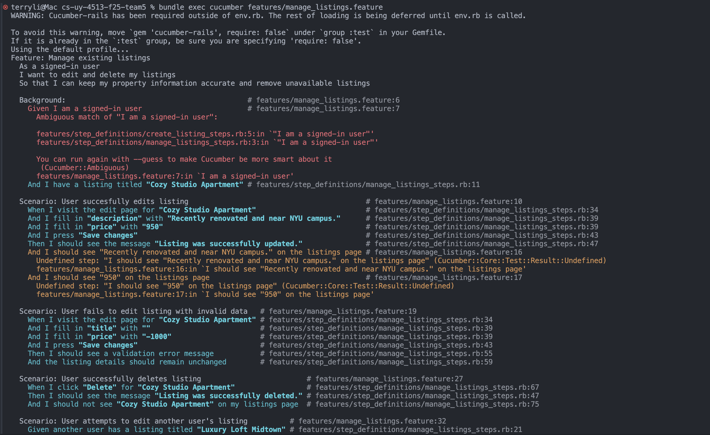
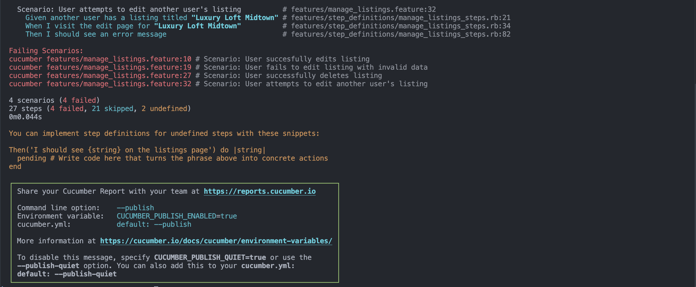

# Manage Listings

## User Story
As a signed-in user, I want to create, edit, and delete my housing listings so that I can manage the properties I'm offering and find potential roommates.

## Acceptance Criteria
1. A signed-in user can edit the details of a listing they own. After editing, the updated information is persisted and visible on the listing’s page.
2. Attempting to edit a listing with invalid data, such as having a blank title or negative price, fails with a validation error and does not overwrite the original listing.
3. A signed-in user can delete one of their own listings. After deletion, the listing is permanently removed from both their profile and the public listings page.
4. Attempting to delete or edit a listing that belongs to another user results in an unauthorized error message.

## MVC Outline

### Models
- `User`
- `Listing`  
  - attributes: `title:string`, `description:text`, `price:decimal`, `city:string`, `user_id:integer`
  - validations: presence of `title`, `price`, and `city`.
  `price` is greater than 0.

### Views
- `listings/edit.html.erb` (Form for editing a user’s own listing)
- `listings/show.html.erb` (Displays listing details)
- `users/show.html.erb` (Displays “My Listings” for the logged-in user with edit and delete options)

### Controllers
- `ListingsController` with `edit`, `update`, and `destroy` actions

### Associations
```ruby
class Listing < ApplicationRecord
  belongs_to :user

  validates :title, :price, :city, presence: true

  validates :price, numericality: { greater_than: 0 }
end

class User < ApplicationRecord
  has_many :listings
end
```

## Screenshots

