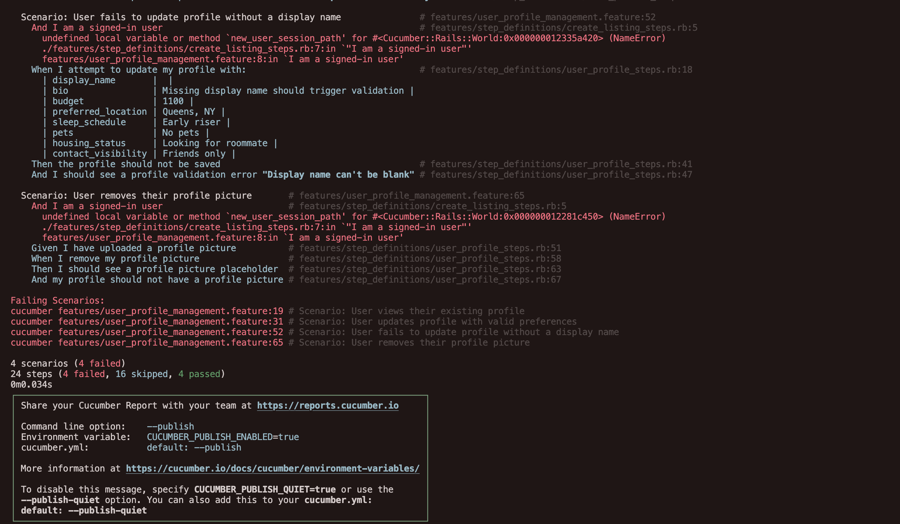

# User Profile Management

## User story

As a signed-in user, I want to manage my roommate profile so that other members can understand my preferences and contact me if we are a good fit.

## Acceptance criteria

1. A signed-in user can visit `/profile` to see their profile details, including display name, bio, budget, preferred location, sleep schedule, pets, housing status, contact visibility, and avatar preview.
2. From the profile page, the user can navigate to `/profile/edit`, update any editable field, submit the form, and see a success flash while the changes persist.
3. Submitting the edit form without a display name fails validation, preserves previously saved data, and shows the error message “Display name can't be blank”.
4. Updating the profile with a negative budget fails validation and shows the error “Budget must be greater than or equal to 0”.
5. Removing the avatar via the edit form replaces it with the default placeholder and detaches the uploaded file from the record.

## MVC Outline

### Models

- `User`
  - attributes: `email:string`, `password:string`, `display_name:string`, `bio:text`, `budget:integer`, `preferred_location:string`, `sleep_schedule:string`, `pets:string`, `housing_status:string`, `contact_visibility:string`
  - attachments: `avatar` 
  - associations: `has_many :listings`, `has_one_attached :avatar`

### Views

- `app/views/profiles/show.html.erb` to present the profile fields and avatar, with links to edit.
- `app/views/profiles/edit.html.erb` to render the profile form.

### Controllers

- `ProfilesController` with `show`, `edit`, and `update` actions.

### Associations

```ruby
class User < ApplicationRecord
  has_many :listings
  has_one_attached :avatar
end
```

### Screenshots




## Follow-up For Authentication Team

- The current profile feature assumes a placeholder `current_user`. When the user login/authentication team delivers real sign-in/sign-out, make sure to delete the bootstrap logic in `app/controllers/application_controller.rb` and replace it with their session handling.
- Add corresponding TDD/BDD coverage (RSpec request specs + Cucumber background steps) that proves a user session is established during login and required before visiting `/profile` or submitting the edit form. This guards against CSRF regressions once the fake user is removed.
- Placeholder tests were added to guide this work:
  - `spec/requests/profiles_spec.rb` includes pending examples under “authentication requirements (TODO)”.
  - `features/user_login_authentication.feature` has the `@todo_auth` scenario “Unauthenticated user is redirected when visiting the profile page” with pending step definitions in `features/step_definitions/user_login_authentication_steps.rb`.
  Update these once the login flow is finished so they assert the real redirect behavior instead of calling `pending`.
